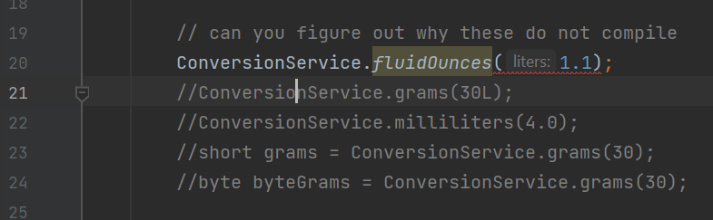

# Primitives Lab

## Step 1: Create the ConversionService class.
In this step, you create a class full of static variables and methods to perform
conversions between kilograms and various units of weight measure. You also add
static variables and methods to convert liters into various units of volume measure.  

1. Create a class named `ConversionService`. Don’t add a main method to ConversionService.
2. Add the following conversion value static variables to the ConversionService class.

    * conversion rate for 1 kilogram to pounds
    * conversion rate for 1 kilogram to grams
    * conversion rate for 1 kilogram to weight ounces
    * conversion rate for 1 liter to fluid ounces
    * conversion rate for 1 liter to gallons
    * conversion rate for 1 liter to pints
    * conversion rate for 1 liter to milliliters


3. Now add the following conversion static methods to the ConversionService.

    * `double pounds(double kilograms)`
    * `int grams(int kilograms)`
    * `double ounces(double kilograms)`
    * `float fluidOunces(float liters)`
    * `float gallons(float liters)`
    * `float pints(float liters)`
    * `int milliliters(int liters)`

3. Save your file, and fix any compiler errors in the ConversionService class 
before moving to the next step.

## Step 2: Run TestConversionService

1. Open `TestConversionService.java` and run. Fix any errors in `ConversionService.java` 
or `TestConversionService.java`. The most likely place for an error is in 
`ConversionService.java`. If you did not follow the directions exactly, the test program 
can fail to compile.
2. When you run the test, the output in the Console view should look like the 
following. If it looks different, go back and try to fix it. Ask for help if you get stuck.
```text
37.1954
0.58124
30000
40000
1763.7
13.94844
16.97542
```

## Step 3: Understanding Downcast and Upcast

With your service and test classes working, now it is time to try out some work with 
numeric primitives in order to understand downcast and upcast. In particular, you 
want to know when/where implicit and explicit casting is required. You also want 
to know why some casting can cause precision problems.

1. Use the cast operator. Note that the following chunk of code is commented 
out in the middle of the TestConversionService main( ) method.

```java
// can you figure out why these do not compile
ConversionService.fluidOunces(1.1);
ConversionService.grams(30L);
ConversionService.milliliters(4.0);
short grams = ConversionService.grams(30);
byte byteGrams = ConversionService.grams(30);
```

2. Uncomment each of the lines of code in this section (there are five lines of 
code to uncomment). When you do, you will notice IntelliJ presents you with a 
compiler error.



3. Can you determine why each of these lines causes a compiler error? Fix each 
line of code so that it compiles using an appropriate cast operation. Here is the first 
one to get you started.

```java
ConversionService.fluidOunces((float)1.1);
```

4. Once you have uncommented all five lines of code and fixed the compiler errors, run 
`TestConversionService.java` again to make sure everything still works. You may want to add 
two lines of code (as shown below) to see grams and byteGrams results in the Console view.

```java
System.out.println(grams);
System.out.println(byteGrams);
```

5. Uncomment the code in this section by removing the block comment around 
the code. Notice this code has no syntax errors. The compiler is able to understand 
the code without casting.

```java
// why do these still work even though the types are different
System.out.println("------------------------------------");
double ounces = ConversionService.fluidOunces(1.1f);
System.out.println(ounces);
long milliliters = ConversionService.milliliters(40);
System.out.println(milliliters);
double decimalMilliliters = ConversionService.milliliters(40);
System.out.println(decimalMilliliters);
short s = 30;
System.out.println(ConversionService.grams(s));
byte b = 4;
System.out.println(ConversionService.milliliters(b));
char z = 'z';
System.out.println(ConversionService.milliliters(z));
System.out.println(ConversionService.gallons(200));
System.out.println(ConversionService.ounces(50.5f));
System.out.println(ConversionService.pints(6L));
System.out.println(ConversionService.pounds(7L));
```
6. Run `TestConversionService.java` and verify it produces the results you see below.
In this section, each call to a static method on ConversionService is provided a parameter
whose type is not the type of the actual parameter of the method in `ConversionService`. 

```text
37.1954
0.58124
30000
40000
1763.7
13.94844
16.97542
------------------------------------
37.19540023803711
40000
40000.0
30000
4000
122000
52.84
1781.337
12.6804
15.432200000000002
```

7. Identify the principal at work. Why do we need to cast in certain situations but not others?
8. Uncomment this code by removing the code blocks around the two 
comparison tests.  

```java
// compare these results. Can you tell why they are different?
System.out.println("------------------------------------");
float bigGallons = 
ConversionService.gallons(123456789123456789L);
System.out.println(bigGallons);
double bigGallons2 = 123456789123456789L * 0.2642;
System.out.println(bigGallons2);
System.out.println("------------------------------------");
int bigGrams = ConversionService.grams(1234567890);
System.out.println(bigGrams);
long bigGrams2 = 1234567890L * 1000L;
System.out.println(bigGrams2);
```

9. Run `TestConversionService` again. The output should look like that shown 
below. Importantly, note the last two sets of numbers. Why are the results of these 
calculations different? Notice that these two chunks of code each call one of the 
`ConversionService` methods and store it in a local variable (`bigGallons` and `bigGrams`). 
The same calculation is also performed using hard coded numbers in the next lines of code. 
Therefore, these calculations should return the same values, but they do not. Determine what 
went wrong.

```text
37.1954
0.58124
30000
40000
1763.7
13.94844
16.97542
------------------------------------
37.19540023803711
40000
40000.0
30000
4000
122000
52.84
1781.337
12.6804
15.432200000000002
------------------------------------
3.26172852E16
3.261728368641728E16
------------------------------------
1912276048
1234567890000
```

## Step 4: Submission

Commit and push all your changes to your GitHub repository
